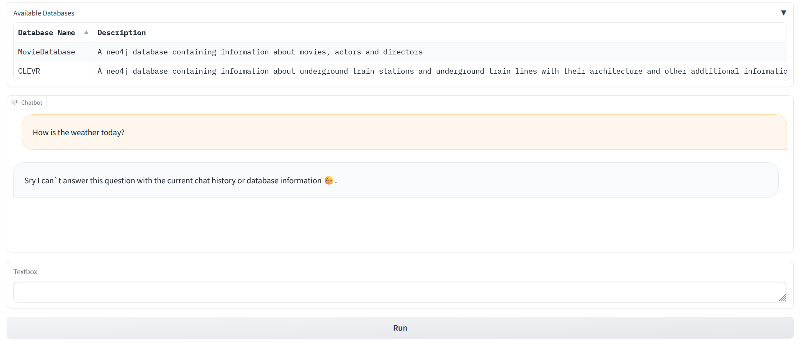
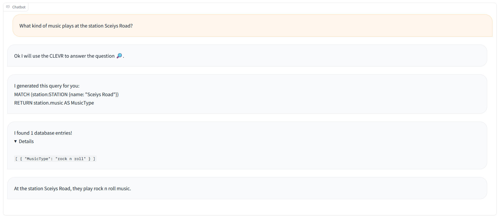

# Text2Cypher

Text2Cypher provides a natural language interface for generating Cypher query language (CQL) statements for Neo4j databases. It is designed to choose from multiple databases based on a specified database schema and can also correct errors in the generated CQL queries.

<p align="center">
<picture>
  <source media="(prefers-color-scheme: dark)" srcset="./resources/darkmode.png">
  <source media="(prefers-color-scheme: light)" srcset="./resources/lightmode.png">
  
  </picture>
  <picture>
  <source media="(prefers-color-scheme: dark)" srcset="./resources/conversation_darkmode.png">
  <source media="(prefers-color-scheme: light)" srcset="./resources/conversation_lightmode.png">
  
</picture>
</p>

## Setup Instructions

Follow these steps to set up the Text2Cypher service:

1. **Environment Configuration**: Copy the contents from [`.example_env`](.example_env) into a new file named `.env`. Insert your OpenAI API key into this file to enable the API integration.
2. **Service Deployment**: Use Docker Compose to build and start the service by running the following commands in your terminal:

   ```bash
   docker compose build && docker compose up
   ```

3. **Accessing the Interface**: After the service starts, open your web browser and go to [localhost:7860](http://localhost:7860) to interact with the Chat UI.

## Graph Initialization

The scripts located in the [`scripts`](/scripts/) subdirectory can be used to initialize the Movie and CLEVR Graphs. 

The CLEVR graphs are synthetically generated and vary with each iteration. To ensure reproducible results, we have included the database files necessary for the CLEVR graph at this [link](https://drive.google.com/file/d/1fJVcK5A3F8BIBVm9MNvfn-l-rJS6XsaS/view?usp=drive_link).

To incorporate these files into your setup, simply mount the `CLEVR` folder into the `clevrdb` container. This will enable the container to access and utilize the provided database files for graph initialization.

## Evaluation

For an overview of the system's performance, refer to the [Evaluation Notebook](Evaluation.ipynb). This notebook provides a basic evaluation of the query generation capabilities of Text2Cypher.